# 酷世DIY ESP32S3 SP V4 核心板开发板介绍 酷世 DIY

# 一、硬件简介

该核心板开发板几乎包含了 ESP32-S3 的全部可实现功能，把 ESP32-S3 的性能发挥到了极致。它具备了彩屏显示(1.69 寸)带电容触摸 CST816S、1 个 ES8311 音频编解码芯片，NS4150 支持 3W 扬声器功放、WS2812 彩灯）、TF 卡座、电池接口。结合自身集成的 Wi-Fi 和 Bluetooth，还有 AI 图像识别和语音识别功能，就可以做出更多实用和有趣的物联网应用。留出了模组的所有 IO 口，用于连接更多的外部的传感器模块以及执行器。

采用 ESP32S3 WROOM-1 N16R8 官方模组，最高配置

模组说明：

**ESP32-S3-WROOM-1-N8**:     8MB Flash 无 Psram

**ESP32-S3-WROOM-1-N8R2**: 8MB Flash  + 2MB PSRAM

四线 Quad Psram 无多余占用 35 36 37 此三个 IO 用户可正常使用

**ESP32-S3-WROOM-1-N8R8**: 8MB Flash  + 8MB PSRAM

八线 Octal Psram 占用了三个 IO（35.36.37）此三个 IO 用户不可使用

**ESP32-S3-WROOM-1-N16R8**: 16MB Flash  + 8MB PSRAM

八线 Octal Psram 占用了三个 IO（35.36.37）此三个 IO 用户不可使用

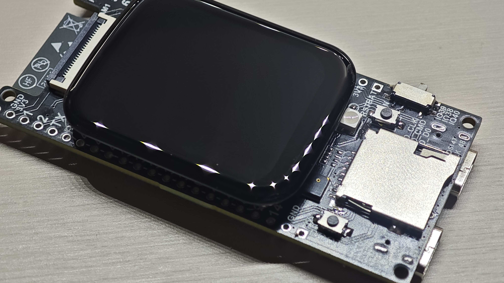

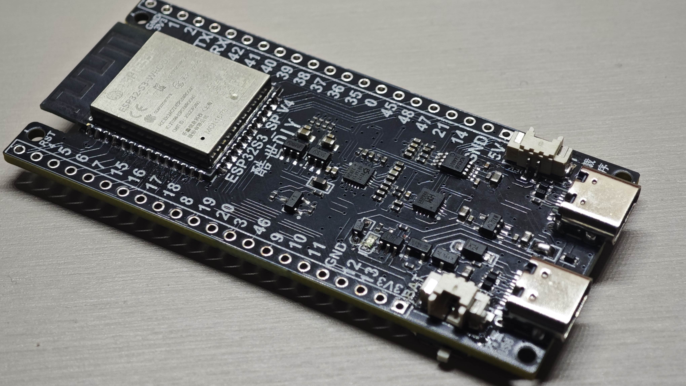

## PCB 结构尺寸

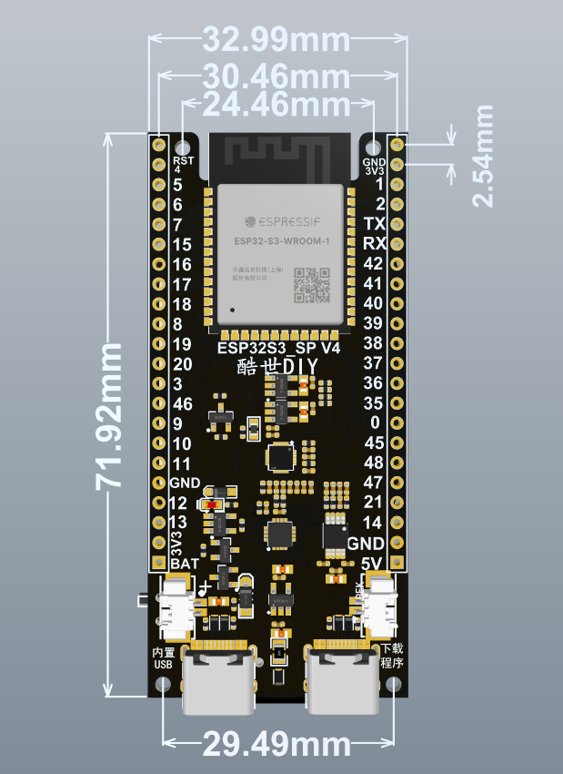

## 硬件接口介绍

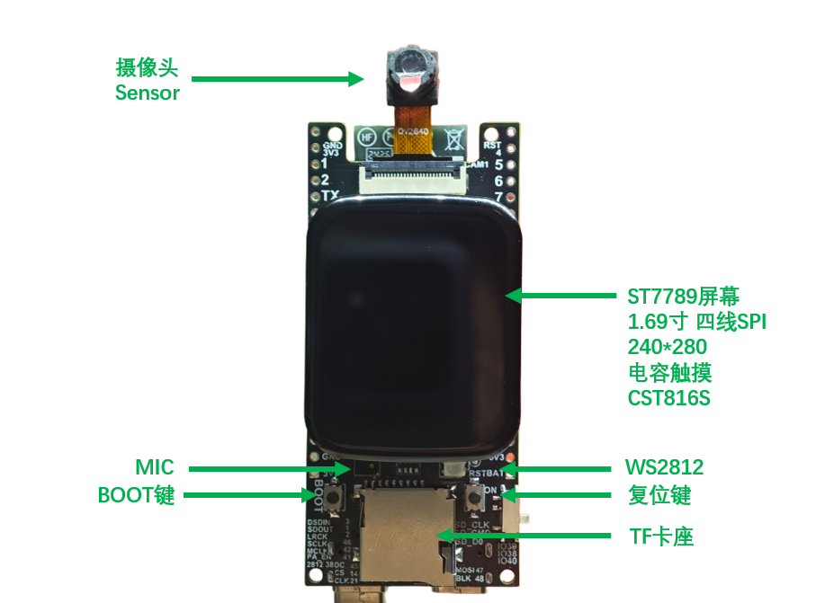

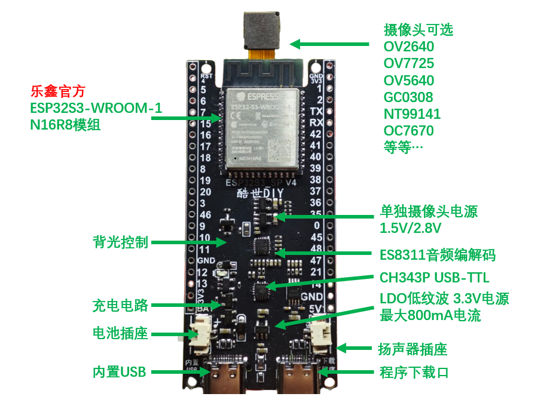

开发板引脚对应：

原理图：

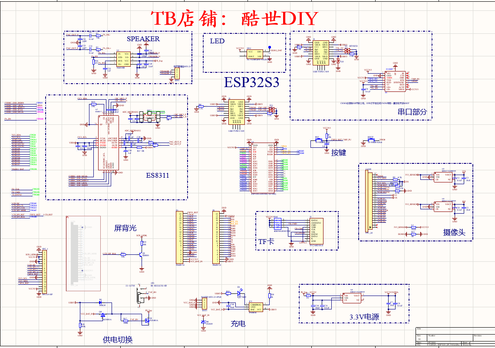

## 提供例程以及应用案例

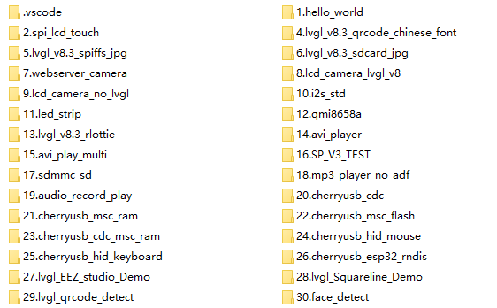

1、LVGL V7/V8/V9 版本代码

2、网页图传代码

3、摄像头显示屏幕（包含 LVGL 和非 LVGL 版本）

4、WS2812 灯光控制（RMT 控制）

5、语音识别（本地语音离线识别使用乐鑫官方 ESP-SR 库）

6、ADC 按键

7、二维码识别

8、USB HOST/DEVICE  U 盘读取 CDC 传输

9、颜色识别

10、AVI 视频播放

11、AVI 视频录制

12、USB 模拟 CDC 串口设备和电脑通信

13、USB 主机模式读取 CH340 一类的串口设备

14、USB 主机模式读取 U 盘数据

15、USB 模拟 U 盘 网页管理文件系统

16、SPI 读写 TF 卡测试

17、人脸识别、猫脸识别

18、网络下载 JPG 图片显示

19、播放 AVI 视频 并且可以网页管理 TF 卡

20、wifi 配置 LVGL 界面

21、LVGL 测试

22、LVGL 的 MP3 播放器

23、USB、串口连接 4G 模块通过 4G 模块上网

24、链接 USB 摄像头显示画面 可切换分辨率

25、Squareline studio 代码

26、EEZ studio 代码

# 二、开始开发

## 1. 安装 ESP IDF 环境

直接点击下面链接可跳转离线安装包教程。

> <u>Windows 快速安装 ESP IDF5.3 环境</u>

### 2. 使用 flash_download_tool 下载工具下载

刚才是在 VSCode 中直接下载程序，接下来看看使用 flash_download_tool 工具如何下载。

flash_download_tool 软件是乐鑫提供的下载软件，可以用于乐鑫所有型号芯片的程序下载。

> flash_download_tool 下载地址：<u>[https://www.espressif.com.cn/zh-hans/support/download/other-tools](https://www.espressif.com.cn/zh-hans/support/download/other-tools)</u>

进入上面链接后，点击“Flash 下载工具”后面的下载按钮。

我下载的是 3.9.7 版本，版本号会不定时更新，不影响使用。

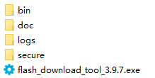

双击 flash_download_tool_3.9.7.exe 打开软件。

选择芯片型号(ChipType)，工作模式(WordMode)选择开发模式(Develop)和工厂模式(Factory)都可以，开发模式界面用于下载一个开发板，工厂模式依次可以下载十个开发板，你用工厂模式下载一个开发板也是可以的。下载模式(LoadMode)选择串口(UART)。点击 OK 进入。

下面是开发模式界面。

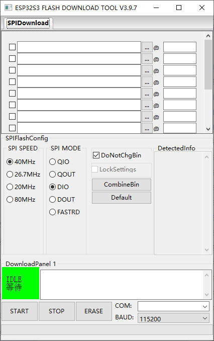

在这个界面，需要加载你要下载的 bin 文件，配置 SPIFlash 相关信息，以及串口相关信息。

我们在使用 VSCode 下载程序时候，终端显示了下载过程的细节，如下图所示。你回到 VSCode 中，右下角点击“python 任务”，然后左边稍微上滑一点，就可以找到。

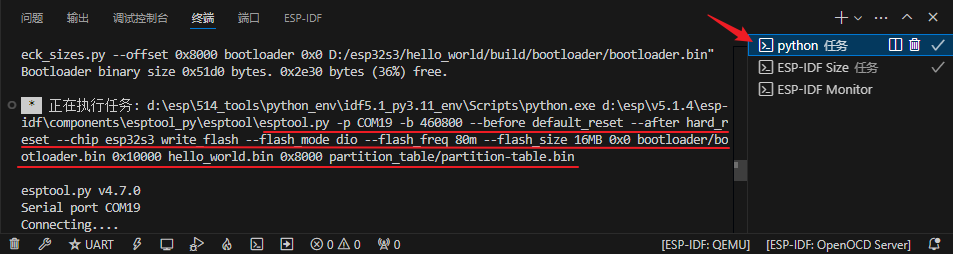

从上图中我们可以看到：

串口号选择 COM19，波特率是 460800。

Flash mode 是 DIO，Flash freq 是 80M，也就是 SPI SPEED。

0x0 位置下载 bootloader.bin 文件，0x10000 位置下载 hello_world.bin 文件，0x8000 位置下载 partition-table.bin 文件。

bootloader.bin 是启动文件，位于 bulid\bootloader 文件夹中。

hello_world.bin 是我们的应用程序文件，位于 bulid 文件夹中。

partition-table.bin 是分区表文件，位于 build\partition_table 文件夹中。分区表用于给 flash 划定分区，类似于 Windows 电脑的 C 盘 D 盘等分区。这里使用的是默认的分区表，默认的分区表在 menuconfig 中已经配置好，在之后的例程中，我们还会定义自己的分区表，在分区表中，还可以建立文件系统，下载 AI 模型。

除了上面的终端过程可以看到这些信息，在 build 文件夹下的 flash_args 文件中也可以看到，如下图所示。

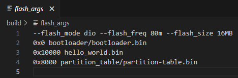

按照上面的提示，就可以完成 flash_download_tool 上的配置，配置之前，你可以把所需要的 bin 文件复制到 flash_download_tool 软件的 bin 文件夹当中，方便加载，也可以不用复制，直接到工程文件夹加载。配置后如下所示。

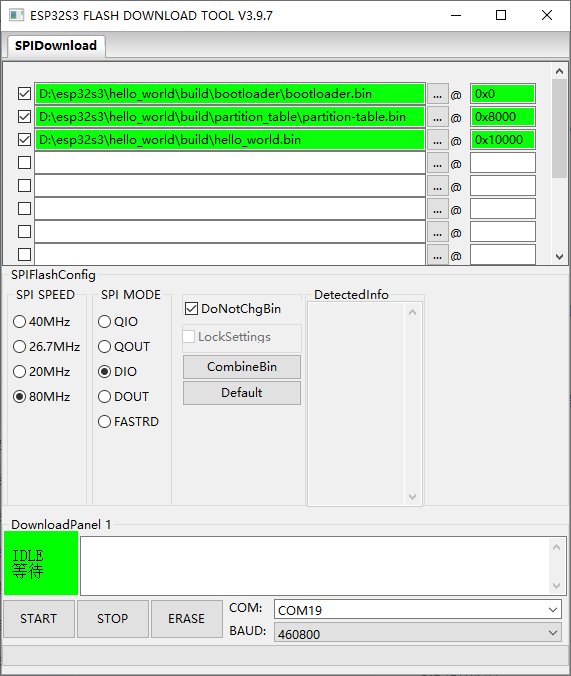

配置好以后，点击左下角的 START，就开始下载了。

> 注意： 1、bin 文件前面的勾一定要勾上，才可以下载对应的 bin 文件。这意味着，你也可以在这里加载很多其它用于测试的 bin 文件，只要不勾选，就不会下载，勾选谁，下载谁。 2、程序下载完之后，程序不会自动运行。需要自己按一下复位键，或者给板子重新上电，程序才会运行。

如果你开发的项目已经完成，需要把程序交给生产人员去下载，可以把上面的三个 bin 文件合成一个 bin 文件，这样以后下载也比较方便。

合成一个 bin 文件的按钮是“CombineBin”，点击一下就合成好了，合成后的文件位于 flash_download_tool 软件的 combine 文件夹当中，名称默认是 target.bin，可以给它修改名称，比如这里改成 hello_world.bin，以后再下载，只需要加载这一个 bin 文件就可以了，如下图所示：

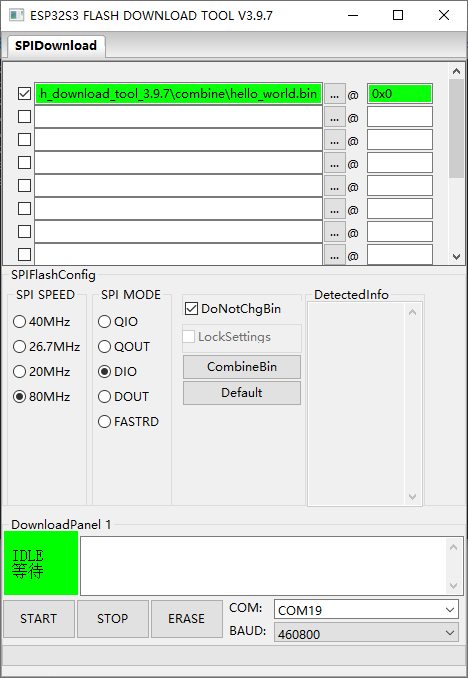

### 2.3 程序源码分析

接下来，我们分析一下源程序代码。

在 app_main 函数中，使用了好几个 printf 输出数据，结合刚才的输出内容，再对照这个程序代码，你就可以看懂了。

几个 printf 输出语句之后，跟了一个 fflush(stdout)，fflush 是 C 语言库函数，使用这个库函数，需要头文件包含 <stdio.h> 文件。fflush(stdin)的作用是清空输入缓冲区，fflush(stdout)的作用是清空输出缓冲区，这里我们使用的是 fflush(stdout)。

printf 输出的内容，是先放在缓冲区的，遇到换行符\n 才会立即输出，如果没有换行符，它就不会及时输出，在没有换行符的情况下，使用 fflush(stdout)就会立即输出，不过，虽然会立即输出，它不会自动换行，要想自动换行，还得加换行符。

在这个例程中，我们去掉 fflush(stdout)，依然会正常执行程序，是因为前面已经有换行符了，这里的 fflush 函数只起到一个保险作用。如果你想试试我们刚才说的内容，可以修改程序试一下。

```
void app_main(void)
{
    while (1)
    {
        printf("Hello world!");
        vTaskDelay(1000 / portTICK_PERIOD_MS);
    }
    // 这里注释掉不用的代码
}
```

```
void app_main(void)
{
    while (1)
    {
        printf("Hello world!");
        fflush(stdout);
        vTaskDelay(1000 / portTICK_PERIOD_MS);
    }
    // 这里注释掉不用的代码
}
```

```
void app_main(void)
{
    while (1)
    {
        printf("Hello world!\n");
        vTaskDelay(1000 / portTICK_PERIOD_MS);
    }
    // 这里注释掉不用的代码
}
```

上面有 3 个代码片段，第 1 个是 printf 中没有加\n 换行符，编译下载后，你会看到 printf 没有及时输出内容，而是间隔一段时间输出一堆。第 2 个加了 fflush 函数，就可以间隔 1 秒输出了，不过没有换行。第 3 个加了换行符，在没有 fflush 函数的情况下，也可以正常及时输出。

> 注释代码，可以使用快捷键 Crtl 和/按键。先选中要注释的代码，然后按住 Crtl 键不要放，然后按一下/键，代码就会被注释，注意输入法要在英文状态下。如果想取消注释，也是 Ctrl 和/键。

# [AI 对话例程](https://icnynnzcwou8.feishu.cn/wiki/R1o1wNiXxij45Ak86DDcOKCHnNd)虾哥开源小智 AI

前提：需要使用这块开发板：

[https://item.taobao.com/item.htm?id=850935502337](https://item.taobao.com/item.htm?id=850935502337)

只需要单板 + 喇叭就可以跑小智

如果需要显示就加触摸屏

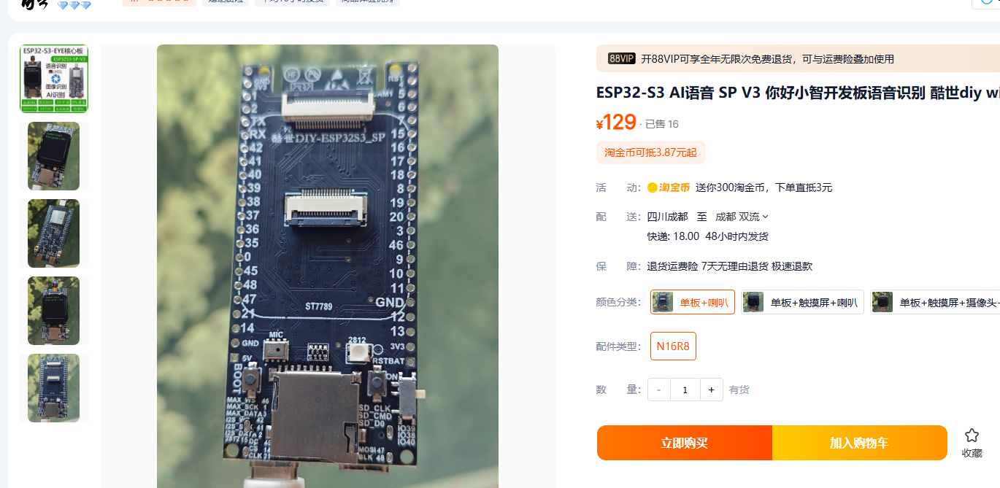

# 1、代码和固件位置：

[https://github.com/78/xiaozhi-esp32](https://github.com/78/xiaozhi-esp32)

控制台链接：xiaozhi.me

小智官方文档：[小智 AI 聊天机器人百科全书](https://ccnphfhqs21z.feishu.cn/wiki/F5krwD16viZoF0kKkvDcrZNYnhb)

改唤醒词教程:[关于唤醒词更改及配置操作步骤](https://rcnv1t9vps13.feishu.cn/wiki/H4dywK6ucigEtykKmm3cmZ7Dnog)

改对话模型在 xiaozhi.me 里注册登陆配置

代码会一直更新

可以直接用 [https://github.com/78/xiaozhi-esp32](https://github.com/78/xiaozhi-esp32) 的源码进行编译，选择 board 为 kevin-sp-v4-dev

board 位置：[https://github.com/78/xiaozhi-esp32/tree/main/main/boards/kevin-sp-v4-dev](https://github.com/78/xiaozhi-esp32/tree/main/main/boards/kevin-sp-v4-dev)

# 2、编译：

搭建编译环境参考：

[Windows 搭建 ESP IDF 5.3.2 开发环境以及编译小智](https://icnynnzcwou8.feishu.cn/wiki/JEYDwTTALi5s2zkGlFGcDiRknXf)

进命令行，进入工程目录后，需要先设置芯片类型为 esp32s3，再 menuconfig 设置 board 类型为 Kevin SP V4 开发板，再 build 编译，如果你都设置过了，那就可以直接运行：

`idf.py build flash monitor`

不要用 vscode 插件编译，vscode 是用来编辑代码的

下载后就可以直接使用

# 3、不会编译只需下载体验

只需下载这个 bin 文件打开 flash download tool 下载即可，一定要使用图中的固件！！！！！！

地址填入 0x0

烧录开机后会进入配网模式，手机连接 Xiaozhi 开头的 wifi 热点，打开手机浏览器进入 192.168.4.1 输入自己 wifi 的 ssid 和密码进行配网，然后电脑浏览器进入 xiaozhi.me 注册登陆输入设备提示的验证码后即可使用

下载过程参考：[Flash 工具/Web 端烧录固件（无 IDF 开发环境）](https://ccnphfhqs21z.feishu.cn/wiki/Zpz4wXBtdimBrLk25WdcXzxcnNS)

如果下载过程中一直卡着不动，可能需要安装串口驱动：

MAC 下的驱动：

Windows 下的驱动：

# [需要使用参考小智 AI 百科全书](https://ccnphfhqs21z.feishu.cn/wiki/F5krwD16viZoF0kKkvDcrZNYnhb)

> 鼠标悬浮在空白行左侧，点击“**+**”插入“**信息收集**”小应用。[了解更多](https://www.feishu.cn/hc/zh-CN/articles/490019170235?from=in_ccm_template_docs)
