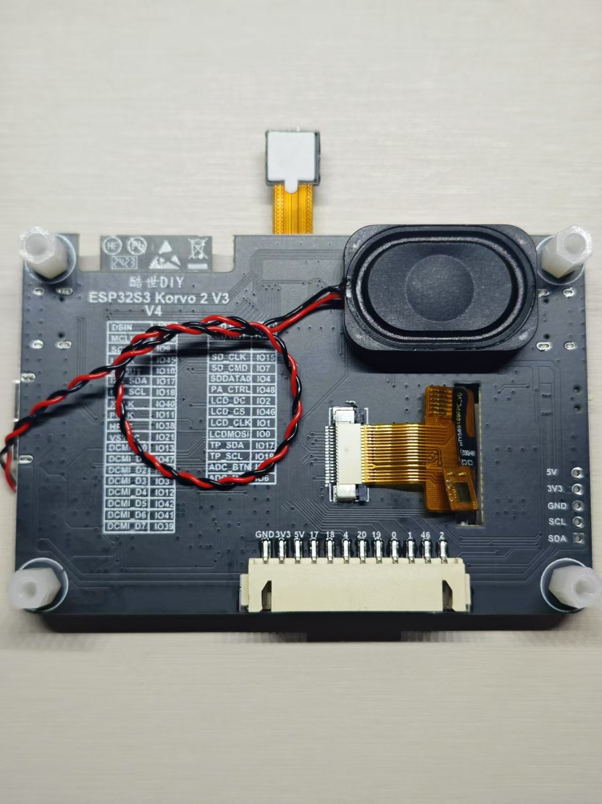
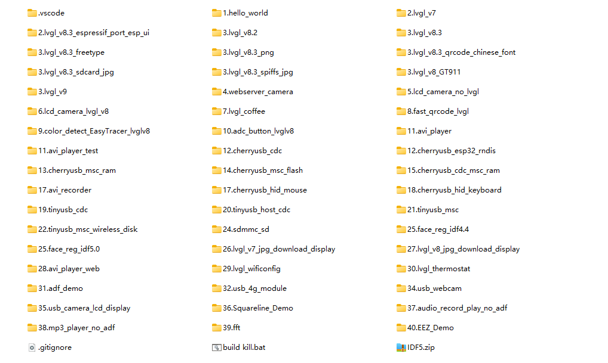

# 一、酷世DIY ESP32S3 Korvo 2 V3板硬件简介

# [一、硬件简介](https://icnynnzcwou8.feishu.cn/wiki/PjxHwvRxOircxUkyRJIcOqQVnQd)

该开发板几乎包含了 ESP32-S3 的全部可实现功能，把 ESP32-S3 的性能发挥到了极致。它具备了彩屏显示(1.69 寸)、电容触摸、完整的音频输入(2 个麦克风)和输出(喇叭)功能。结合自身 Wi-Fi 和 Bluetooth，还有 AI 图像识别和语音识别功能，就可以做出更多实用和有趣的物联网应用。留出了 IIC 拓展接口，用于连接更多的外部的传感器模块以及执行器。

采用 ESP32S3 WROOM-1 N16R8 官方模组，最高配置

模组说明：

**ESP32-S3-WROOM-1-N8**:     8MB Flash 无 Psram

**ESP32-S3-WROOM-1-N8R2**: 8MB Flash  + 2MB PSRAM

四线 Quad Psram 无多余占用 35 36 37 此三个 IO 用户可正常使用

**ESP32-S3-WROOM-1-N8R8**: 8MB Flash  + 8MB PSRAM

八线 Octal Psram 占用了三个 IO（35.36.37）此三个 IO 用户不可使用

**ESP32-S3-WROOM-1-N16R8**: 16MB Flash  + 8MB PSRAM

八线 Octal Psram 占用了三个 IO（35.36.37）此三个 IO 用户不可使用

## PCB 结构尺寸

## 硬件接口介绍

<table>
<tr>
<td>接口 </td><td> </td><td> </td></tr>
<tr>
<td>右USB </td><td>Type-C </td><td>ESP32S3内置的USB，可插4G模块、U盘、USB摄像头、也可做为USB从机模拟U盘网卡、模拟声卡等等一系列USB应用 </td></tr>
<tr>
<td>左USB </td><td>Type-C </td><td>用于下载程序和查看日志，USB转串口芯片采用的CH9102F，带自动下载电路 </td></tr>
<tr>
<td>左下方排针 </td><td> </td><td>可外接IIC设备，例如温湿度传感器 </td></tr>
<tr>
<td>左上方TF卡座 </td><td> </td><td>可插TF卡，使用1 Line SDMMC接口，总共占用三个IO </td></tr>
<tr>
<td>中上方FPC座 </td><td>DVP接口 </td><td>可插24P的DVP摄像头，型号可以是OV2640\OV3660\OV7725\GC0308等等 </td></tr>
<tr>
<td>左下方1.25座 </td><td>电池接口 </td><td>接3.7V锂电池 </td></tr>
<tr>
<td>右下方1.25座 </td><td>喇叭接口 </td><td>最大支持3W功放喇叭 </td></tr>
<tr>
<td>模组 </td><td>ESP32-S3-WROOM-1-N16R8 </td><td>搭载 Xtensa® 32 位 LX7 双核处理器，主频高达 240 MHz，内置SRAM 512kB，外置PSRAM 8MB，外置FLASH 16MB，2.4 GHz Wi-Fi (802.11 b/g/n) 40MHz带宽，Bluetooth 5 (LE) 和 Bluetooth Mesh，集成AI向量指令，加速神经网络计算和信号处理 </td></tr>
<tr>
<td>显示屏 </td><td>ST7789 </td><td>1.69寸、IPS全视角、分辨率240*280、SPI接口 </td></tr>
<tr>
<td>触摸屏 </td><td>CST816 </td><td>电容触摸、I2C接口 </td></tr>
<tr>
<td>音频DAC </td><td>ES8311 </td><td>单通道、I2C接口 </td></tr>
<tr>
<td>音频ADC </td><td>ES7210 </td><td>四通道(开发板用三个通道)、I2C接口 </td></tr>
<tr>
<td>音频功放 </td><td>NS4150B </td><td>单声道D类音频放大器 </td></tr>
<tr>
<td>麦克风 </td><td>MSM381A3729H9CP </td><td>配套双路麦克风、模拟输出 </td></tr>
<tr>
<td>喇叭 </td><td> </td><td>3520音腔喇叭、3W </td></tr>
<tr>
<td>USB转串口 </td><td>CH9102F </td><td>波特率最大4Mbps </td></tr>
<tr>
<td>电源芯片 </td><td>AP3410 </td><td>提供2A电流 </td></tr>
<tr>
<td>IO扩展芯片 </td><td>TCA9554 </td><td>用于控制屏幕背光和复位 </td></tr>
<tr>
<td>ADC按键 </td><td>IO5 </td><td>6个按键可用 </td></tr>
<tr>
<td> </td><td> </td><td> </td></tr>
</table>

## 硬件引脚对应介绍

<table>
<tr>
<td>功能引脚 </td><td>Pin </td></tr>
<tr>
<td>I2C SDA </td><td>GPIO17 </td></tr>
<tr>
<td>I2C SCL </td><td>GPIO18 </td></tr>
<tr>
<td>I2S DSDIN </td><td>GPIO8 </td></tr>
<tr>
<td>I2S LRCK </td><td>GPIO45 </td></tr>
<tr>
<td>I2S SDOUT </td><td>GPIO10 </td></tr>
<tr>
<td>I2S SCLK </td><td>GPIO9 </td></tr>
<tr>
<td>I2S MCLK </td><td>GPIO16 </td></tr>
<tr>
<td>PA_CTRL </td><td>GPIO48 </td></tr>
<tr>
<td>LCD CS </td><td>GPIO46 </td></tr>
<tr>
<td>LCD CLK </td><td>GPIO1 </td></tr>
<tr>
<td>LCD MOSI </td><td>GPIO0 </td></tr>
<tr>
<td>LCD RST </td><td>和esp32一起复位，不需要控制 </td></tr>
<tr>
<td>TF SD CLK </td><td>GPIO15 </td></tr>
<tr>
<td>TF SD CMD </td><td>GPIO7 </td></tr>
<tr>
<td>TF SD DATA0 </td><td>GPIO4 </td></tr>
</table>

## 提供例程以及应用案例

1、LVGL V7/V8/V9 版本代码

2、网页图传代码

3、摄像头显示屏幕（包含 LVGL 和非 LVGL 版本）

4、WS2812 灯光控制（RMT 控制）

5、语音识别（本地语音离线识别使用乐鑫官方 ESP-SR 库）

6、ADC 按键

7、二维码识别

8、USB HOST/DEVICE  U 盘读取 CDC 传输

9、颜色识别

10、AVI 视频播放

11、AVI 视频录制

12、USB 模拟 CDC 串口设备和电脑通信

13、USB 主机模式读取 CH340 一类的串口设备

14、USB 主机模式读取 U 盘数据

15、USB 模拟 U 盘 网页管理文件系统

16、SPI 读写 TF 卡测试

17、人脸识别、猫脸识别

18、网络下载 JPG 图片显示

19、播放 AVI 视频 并且可以网页管理 TF 卡

20、wifi 配置 LVGL 界面

21、LVGL 测试

22、LVGL 的 MP3 播放器

23、USB、串口连接 4G 模块通过 4G 模块上网

24、链接 USB 摄像头显示画面 可切换分辨率

25、Squareline studio 代码

26、EEZ studio 代码

27、ESP UI 移植
